## TP_2 

### A. Modification d'adresse IP - pt. 1

**Calcul des IP disponibles :**
En prenant pour exemple un réseau classique de type `/24` (masque `255.255.255.0`), comme par exemple `192.168.2.0/24` (à adapter avec l'IP de ton réseau Ingésup) :
- **Adresse réseau :** `192.168.2.0` (Non disponible pour un hôte)
- **Première IP disponible :** `192.168.2.1`
- **Dernière IP disponible :** `192.168.2.254`
- **Adresse de broadcast :** `192.168.2.255` (Non disponible pour un hôte)

*La modification de la carte WiFi est réalisée depuis l'interface graphique de l'OS (Paramètres Réseau).*
Pour vérifier que la modification a bien été prise en compte, la commande utilisée est :
- Sous Windows : `ipconfig`
- Sous Linux : `ip a`
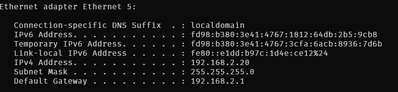

### B. `nmap`

Pour scanner le réseau WiFi et lister les hôtes actifs afin de trouver une adresse IP libre (une IP qui **n'est pas** dans la liste retournée) :
`nmap -sn -PE 192.168.2.0/24`
```resulat
nmap -sn -PE 192.168.2.0/24
Starting Nmap 7.98 ( https://nmap.org ) at 2026-02-23 23:15 +0100
Nmap scan report for unifi.localdomain (192.168.2.1)
Host is up (0.0020s latency).
MAC Address: E4:38:83:2F:4E:5D (Ubiquiti)
Nmap scan report for Mac.localdomain (192.168.2.12)
Host is up (0.16s latency).
MAC Address: 3A:62:69:A9:21:22 (Unknown)
Nmap scan report for DESKTOP-NRPKC36.localdomain (192.168.2.13)
Host is up (0.00s latency).
MAC Address: 3C:7C:3F:EF:67:9E (ASUSTek Computer)
Nmap scan report for DTUP-4121A01A03D8.localdomain (192.168.2.21)
Host is up (0.0010s latency).
MAC Address: 48:4D:A0:1A:03:D8 (Unknown)
Nmap scan report for zendure.localdomain (192.168.2.23)
Host is up (0.0050s latency).
MAC Address: 34:CD:B0:8D:EE:58 (Espressif)
Nmap scan report for shellypro3em-9454c5b9a70c.localdomain (192.168.2.24)
Host is up (0.019s latency).
MAC Address: 94:54:C5:B9:A7:0C (Espressif)
Nmap scan report for Netatmo.localdomain (192.168.2.25)
Host is up (0.021s latency).
MAC Address: 70:EE:50:2C:E5:26 (Netatmo)
Nmap scan report for 192.168.2.26
Host is up (0.011s latency).
MAC Address: 94:A1:A2:84:C9:DF (Ampak Technology)
Nmap scan report for TYDOM-04DCE3.localdomain (192.168.2.31)
Host is up (0.00s latency).
MAC Address: 00:1A:25:04:DC:E3 (Delta Dore)
Nmap scan report for 192.168.2.33
Host is up (0.21s latency).
MAC Address: 18:DE:50:E1:C2:C4 (Tuya Smart)
Nmap scan report for 8_ports_salon.localdomain (192.168.2.34)
Host is up (0.0020s latency).
MAC Address: 50:C7:BF:F8:AC:DF (TP-Link Technologies)
Nmap scan report for USW-Lite-16-PoE.localdomain (192.168.2.35)
Host is up (0.065s latency).
MAC Address: 78:45:58:F2:F0:CB (Ubiquiti)
Nmap scan report for iPhone.localdomain (192.168.2.38)
Host is up (0.22s latency).
MAC Address: 22:41:EB:7C:C7:18 (Unknown)
Nmap scan report for homeassistant.localdomain (192.168.2.45)
Host is up (0.00s latency).
MAC Address: 02:3B:26:65:26:93 (Unknown)
Nmap scan report for Salon.localdomain (192.168.2.47)
Host is up (0.0010s latency).
MAC Address: 60:22:32:34:13:64 (Ubiquiti)
Nmap scan report for 192.168.2.50
Host is up (0.011s latency).
MAC Address: B8:E9:37:54:61:66 (Sonos)
Nmap scan report for Sejour.localdomain (192.168.2.55)
Host is up (0.0020s latency).
MAC Address: C0:95:6D:7D:35:81 (Apple)
Nmap scan report for Pixel-6.localdomain (192.168.2.56)
Host is up (0.21s latency).
MAC Address: 72:DA:B7:56:53:3D (Unknown)
Nmap scan report for wlan0.localdomain (192.168.2.57)
Host is up (0.10s latency).
MAC Address: 38:2C:E5:95:F3:C0 (Tuya Smart)
Nmap scan report for 192.168.2.61
Host is up (0.14s latency).
MAC Address: 34:7E:5C:F1:F3:44 (Sonos)
Nmap scan report for 192.168.2.62
Host is up (0.32s latency).
MAC Address: B8:E9:37:85:8B:AC (Sonos)
Nmap scan report for 192.168.2.63
Host is up (0.20s latency).
MAC Address: 8E:E6:59:0E:57:29 (Unknown)
Nmap scan report for SR940-21243000202920130933069718N5.localdomain (192.168.2.64)
Host is up (0.027s latency).
MAC Address: 84:C3:E8:24:DB:A6 (Vaillant GmbH)
Nmap scan report for SonosZP.localdomain (192.168.2.65)
Host is up (0.15s latency).
MAC Address: 34:7E:5C:F0:92:A2 (Sonos)
Nmap scan report for 192.168.2.66
Host is up (0.0040s latency).
MAC Address: 94:9F:3E:45:CD:CA (Sonos)
Nmap scan report for Chambres.localdomain (192.168.2.68)
Host is up (0.0010s latency).
MAC Address: 60:22:32:34:2B:E4 (Ubiquiti)
Nmap scan report for Bureau.localdomain (192.168.2.82)
Host is up (1.6s latency).
MAC Address: 78:45:58:D7:34:42 (Ubiquiti)
Nmap scan report for 192.168.2.86
Host is up (0.0010s latency).
MAC Address: 10:B6:76:A9:3E:5D (HP)
Nmap scan report for shellypro3em-ece334edff28.localdomain (192.168.2.88)
Host is up (0.14s latency).
MAC Address: EC:E3:34:ED:FF:28 (Espressif)
Nmap scan report for 192.168.2.90
Host is up (0.00s latency).
MAC Address: 94:9F:3E:64:A4:15 (Sonos)
Nmap scan report for 192.168.2.99
Host is up (0.12s latency).
MAC Address: 70:EE:50:0C:55:4E (Netatmo)
Nmap scan report for 192.168.2.100
Host is up (0.0010s latency).
MAC Address: 00:11:32:5B:2F:05 (Synology Incorporated)
Nmap scan report for 192.168.2.110
Host is up (0.00s latency).
MAC Address: 48:4D:7E:ED:3A:A9 (Dell)
Nmap scan report for proxy.linheberg.fr (192.168.2.111)
Host is up (0.00s latency).
MAC Address: BC:24:11:A4:7C:49 (Proxmox Server Solutions GmbH)
Nmap scan report for 192.168.2.116
Host is up (0.00s latency).
MAC Address: BC:24:11:B0:1D:F0 (Proxmox Server Solutions GmbH)
Nmap scan report for 192.168.2.130
Host is up (0.00s latency).
MAC Address: 4C:CC:6A:2B:AF:FE (Micro-Star Intl)
Nmap scan report for desktop.localdomain (192.168.2.20)
Host is up.
Nmap done: 256 IP addresses (37 hosts up) scanned in 26.39 seconds
```

### C. Modification d'adresse IP - pt. 2

Après avoir repéré une adresse IP libre grâce au scan `nmap`, l'IP est modifiée dans l'interface graphique.
L'adresse de la passerelle (Gateway) a volontairement été modifiée par une adresse erronée (ex: une IP inexistante ou l'IP libre d'un autre étudiant).

Pour tester la connexion à internet et prouver que la mauvaise passerelle empêche la sortie du réseau local, la commande utilisée est :
`ping 8.8.8.8` 
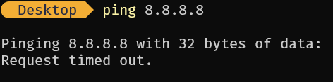


#### II. Exploration locale en duo

### 1. Prérequis
Pour connecter deux ordinateurs, il faut un câble RJ45 et que les firewalls soient désactivés pour éviter les blocages.

### 2. Câblage
Il suffit de brancher le câble entre les deux PCs. C’est comme relier deux maisons avec une route.


### 3. Création du réseau
Quand on donne une adresse IP à une carte réseau, le réseau existe automatiquement. Pas besoin de créer un réseau, il suffit de configurer les IP.

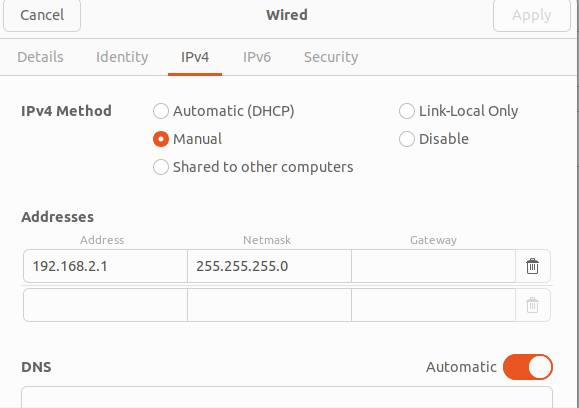


### 4. Modification d’adresse IP
On vérifie avec `ping` si les deux peuvent se parler.

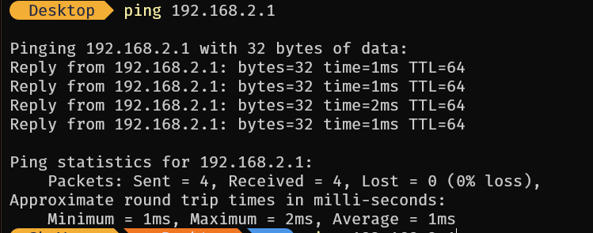
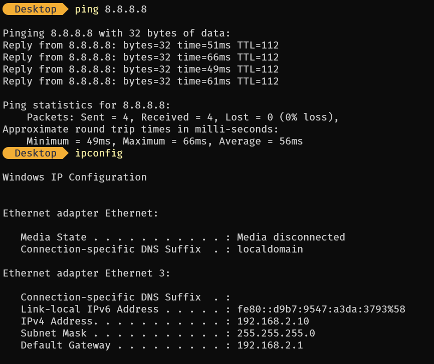

### 5. Utilisation d’un PC comme gateway
Un PC peut partager sa connexion internet avec l’autre. On désactive le WiFi sur un PC, puis on configure l’autre comme passerelle. Ainsi, le PC sans WiFi peut accéder à internet grâce à l’autre.

### 6. Chat privé avec netcat
Netcat permet de discuter entre deux PCs comme un chat très simple. Un PC écoute, l’autre se connecte, et on peut échanger des messages.

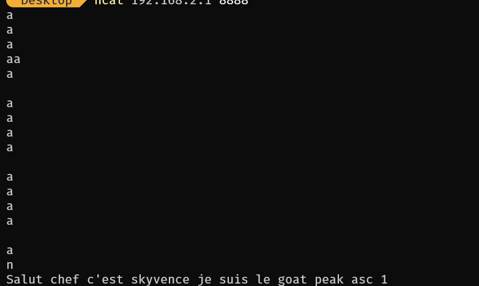
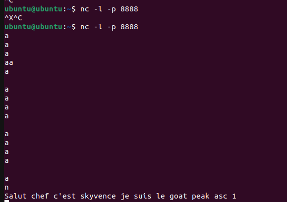
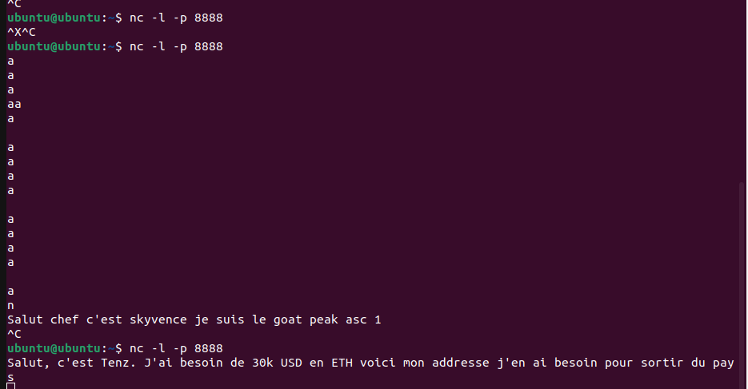

### 7. Wireshark
Wireshark sert à voir ce qui se passe sur le réseau, comme observer les messages qui circulent entre les deux PCs.

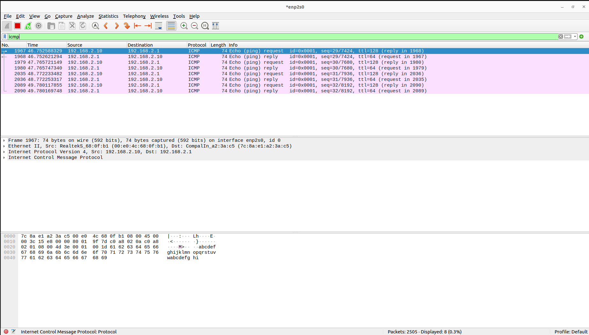
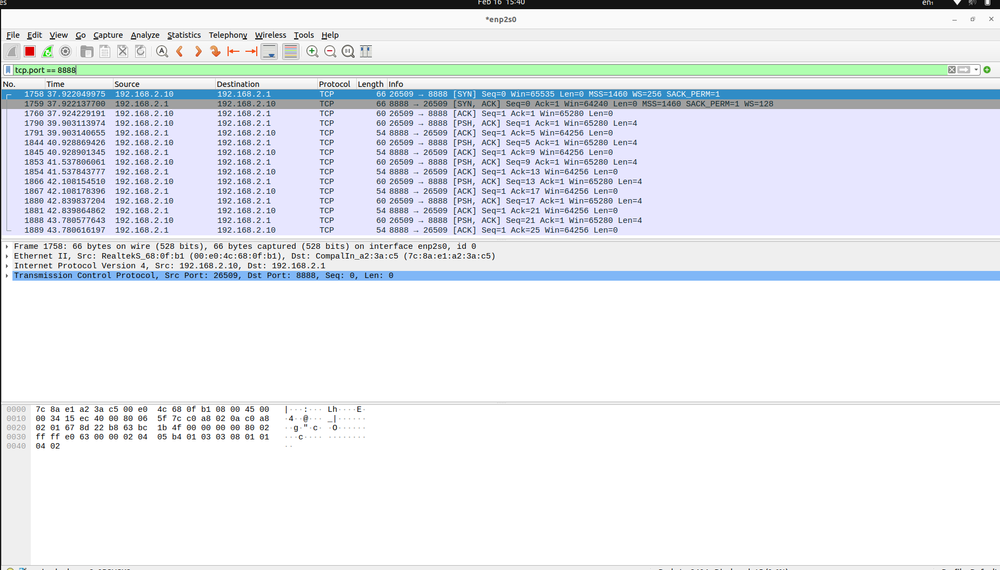
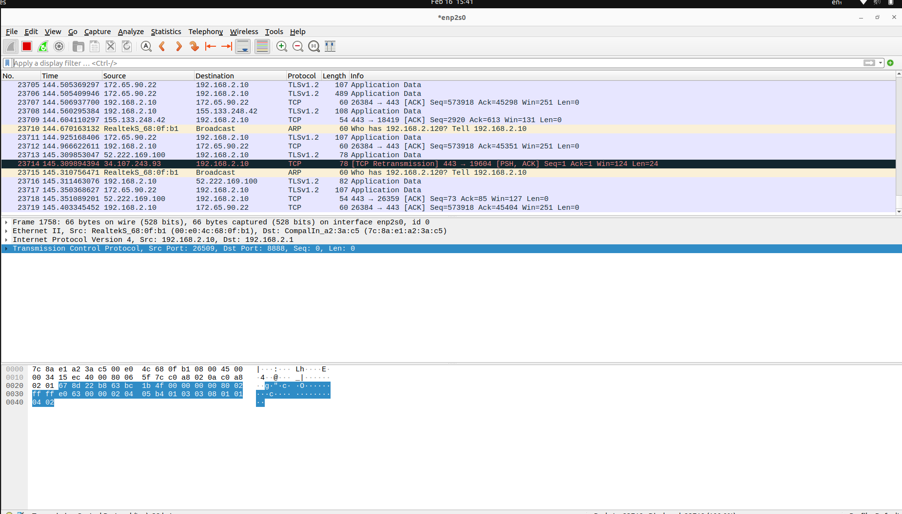
### 8. Firewall
Le firewall protège le PC, mais il peut bloquer certains échanges. On doit le configurer pour autoriser le ping et netcat sur un port précis.

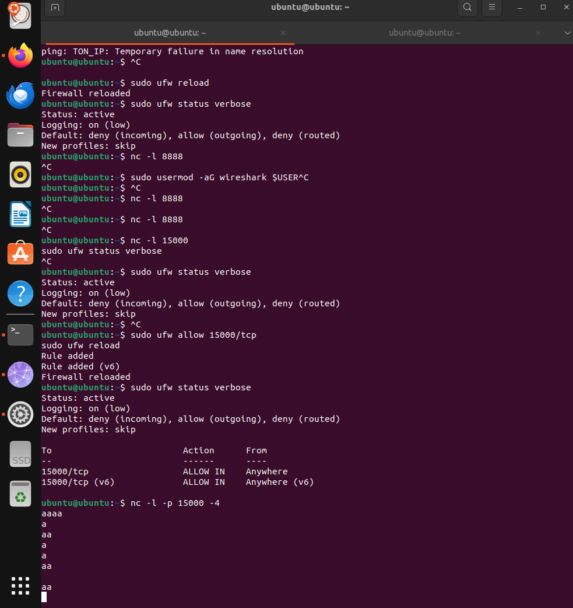
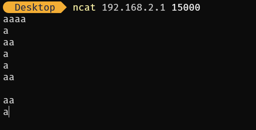
